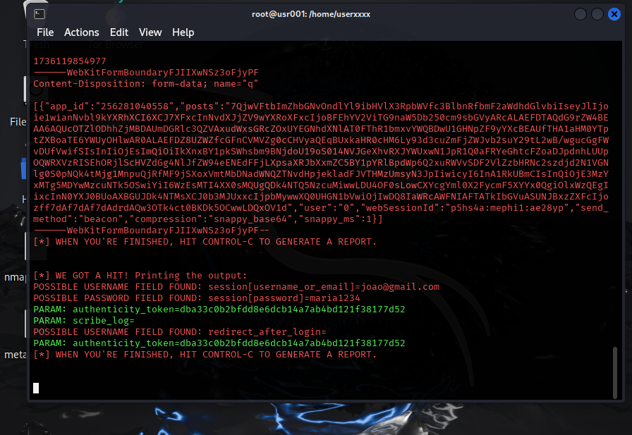

# Phishing para captura de senhas do Twitter

## Ferramentas usadas

* Kali linux
* setoolkit

## Configurando o Phishing no Kali Linux

* Acesso root: sudo su
* Iniciando o setoolkit: setoolkit
* Tipo de ataque: >Social-Engineering Attacks
* Vetor de ataque: >Website Attack Vectors
* Método de ataque: >Credential Harvester Attack Method
* Método de ataque: >Web Templates
* Obtendo o endereço da máquina: >ifconfig
* Template do ataque: >Twitter
* URL para clone: (http://www.twitter.com)

## Resultados

